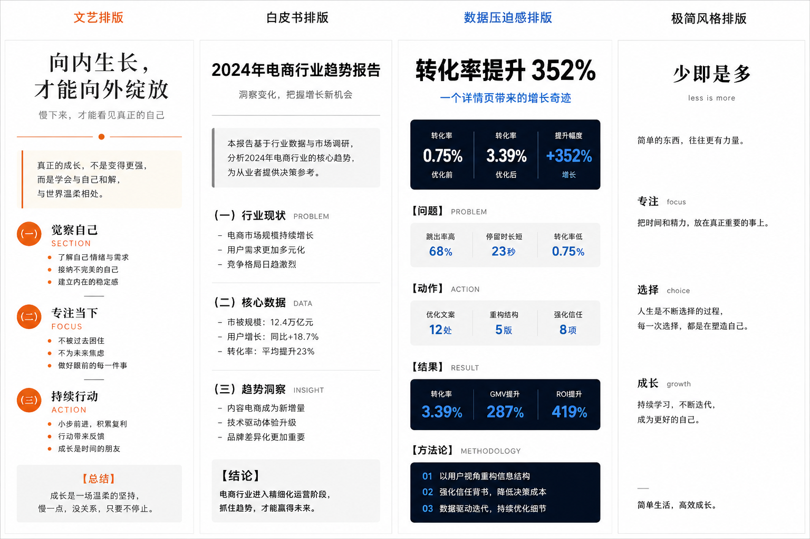

# gongzhonghao-style

微信公众号文章排版与发文适配 skill。



当用户希望把正文、链接、Markdown 文档或已有文章上传、发布、转载、搬运到微信公众号时，使用这个 skill 将内容改造成适合公众号后台粘贴和二次编辑的文章版本。

## 核心限制

这个 skill 默认只做公众号排版适配，不扩写正文内容。

标题可以按公众号传播需求重写为爆款软文标题，但不能承诺正文没有的结果、数据、冲突或事实。

允许自由调整：

- 标题、副标题、摘要
- 段落拆分和留白
- 列表、引用、分隔线
- 字体风格描述
- 文艺、白皮书、数据压迫感、极简等版式

默认不允许：

- 新增原文没有的事实、案例、数据、观点或结论
- 把短文扩成长文
- 把一个句子扩成多章节文章
- 在链接不可读或来源不完整时生成可发布正文

如果用户明确要求扩写或重写，才可以在保留原意的基础上扩展正文。

最终发布边界：

- 可以把转写排版后的内容保存到公众号草稿箱
- 可以返回草稿预览、标题、摘要、封面建议和检查项
- 作者必须手动预览、确认并发布
- agent 不应直接发布、群发或定时发布

## Agent 兼容性

这个 skill 面向各种 agent 使用，不绑定某一个模型、客户端或运行环境。只要 agent 能读取 `SKILL.md`，就可以按照统一规则完成公众号文章改写、排版和发布前检查。

不同 agent 的使用方式：

- 普通文本 agent：输出可复制到公众号后台的排版正文。
- 文件型 agent：读取 Markdown、本地文档或素材文件后生成公众号版本。
- 浏览型 agent：读取用户提供的网页链接并整理成公众号文章；无法读取时要求用户补充正文。
- 腾讯生态 / WorkBuddy agent：最适合打通微信公众号后台，可在授权范围内保存到草稿箱、填写标题、正文、摘要和封面建议，并返回预览或待确认状态。

原则上，自动化 agent 可以辅助“保存草稿”和“填充后台”，但发布必须由作者手动完成。

## 适用场景

典型触发说法包括：

- 把 xxx 上传到微信公众号
- 发布公众号文章
- 写成公众号
- 改成公众号文
- 转载成公众号
- 搬运到公众号
- 做公众号排版
- 放到公众号后台

这个 skill 不是普通 Markdown 美化工具。它会优先考虑微信公众号的手机阅读体验、后台可粘贴性、转载来源、事实核验和排版风格一致性。

## 输入形式

支持以下输入：

- 直接粘贴的正文
- 外部链接
- Markdown 文档内容
- 已有公众号草稿
- 混合素材，例如标题、摘要、链接、数据和备注

如果输入是链接但无法读取正文，执行者应要求用户补充正文或可访问链接，不应凭空生成原文内容，也不应输出基于常识扩写的“可发布正文”。

如果输入内容很短，默认只做轻量公众号化处理，不扩写正文。除非用户明确要求扩写，否则只补必要标题、导语、分段和发布检查。对 1-2 句话的短输入，正文默认控制在原文信息量以内或接近原文信息量。

如果 1-2 句话短输入同时要求 WorkBuddy、腾讯生态、上传后台或创建草稿，使用“短草稿模式”：标题 + 1 句副标题 + 原文拆行正文 + 发布前检查 + `wechat_draft_handoff`。不要新增章节、案例、论证、列表或结论段。

## 内置排版风格

### 文艺排版

适合散文、人物、品牌故事、文化观察、生活方式文章。

核心特征：

- 衬线体大字感主标题
- 灰色副标题
- 橙色渐变线与小圆点
- 左侧橙色竖线和浅米底引言块
- 编号章节加英文辅助标签
- 橙色圆点列表
- 浅灰底总结框

### 白皮书排版

适合行业报告、政策分析、研究型文章、产品说明、B2B 内容。

核心特征：

- 黑体大字感主标题
- 更小一号灰色副标题
- 细灰横线
- 左侧灰色竖线和浅灰底引言块
- 编号章节加全大写英文标签
- 标准短横线列表
- 浅灰底结论框

### 数据压迫感排版

适合增长复盘、商业案例、经营分析、趋势判断和强结果表达。

核心特征：

- 粗黑大字感主标题
- 蓝色结果感副标题
- 用数据块替代分隔线
- 直接进入关键数据
- 【结果】【问题】【动作】等模块标签
- 数字优先列表
- 深色底或灰底方法论总结

### 极简风格排版

适合短观点、认知笔记、作者专栏和克制表达。

核心特征：

- 黑体大字感主标题
- 无副标题或极短副标题
- 不使用装饰分隔线
- 单行短句引言
- 无编号章节
- 极简短句
- 无边框总结

## 默认输出

默认输出结构为：

```markdown
# [公众号标题]

> [副标题或导语，按风格决定是否保留]

[排版后的正文，可直接复制到公众号后台]

---

## 发布前检查

- 来源/授权：
- 标题风险：
- 数据/事实核验：
- 配图建议：
- 公众号后台注意：
```

如果用户明确要求“只给正文”，skill 应只输出可复制到公众号后台的正文。

如果用户要求 HTML，skill 应输出简洁 HTML，避免复杂 CSS、脚本、SVG、外链字体等公众号后台可能无法稳定保留的内容。

## WorkBuddy / 腾讯生态交接

当 agent 具备腾讯生态或 WorkBuddy 能力，并且用户要求继续衔接微信公众号后台时，可以在正文之后输出 `wechat_draft_handoff` 交接 payload。

用途：

- 保存到公众号草稿箱
- 填充标题、摘要、作者、正文
- 传递来源、授权、封面建议和发布前检查
- 给下游自动化返回预览或待确认状态

关键原则：

- 默认只保存草稿，不直接发布
- `publish_permission` 应为 `author_manual_publish_only`
- 作者必须手动发布
- 来源授权不确定时写 `pending` 或 `unknown`
- 正文放在 `body` 字段，不放分析过程
- 用户只要排版稿时，不输出交接 payload

## 转载和搬运注意事项

转载、搬运、改写场景必须保留合规意识：

- 不伪装原创，除非用户明确拥有版权或授权
- 保留来源、作者、原链接、转载说明等必要信息
- 不大段照搬受版权保护内容
- 可以做摘要、评论、解读和少量必要引用
- 对新闻、政策、价格、法律、医疗、金融等时效性内容进行核验或标注待核实
- 如果用户要求去来源、洗稿、规避版权或伪原创，应拒绝该部分请求，并给出合规替代方案

## 目录结构

```text
gongzhonghao-style/
├── SKILL.md
├── README.md
├── assets/
│   └── gongzhonghao-style-preview.png
└── evals/
    └── evals.json
```

## 测试用例

测试用例位于：

```text
evals/evals.json
```

当前覆盖：

- 白皮书排版：Markdown 行业观察文章
- 数据压迫感排版：私域转化数据复盘
- 极简风格排版：外部链接转载场景
- 文艺排版：短文搬运到公众号
- WorkBuddy 交接：保存到草稿箱、作者手动发布、标题可优化但正文不扩写

这些测试用例用于检查 skill 是否能在不同输入和风格下稳定触发，并输出符合公众号后台使用习惯的内容。

## 维护建议

- 新增风格时，先在 `SKILL.md` 中补充风格规则，再在 `evals/evals.json` 中增加对应测试 prompt。
- 调整触发词时，同时更新 `SKILL.md` 的 frontmatter description 和本 README 的适用场景。
- 如果未来要接入真实公众号后台自动上传流程，优先让腾讯生态或 WorkBuddy agent 承担后台衔接；仍建议将“排版适配”和“保存草稿箱”拆成两个明确阶段。发布必须由作者手动完成，不要让 skill 承担直接发布、群发或定时发布动作。
